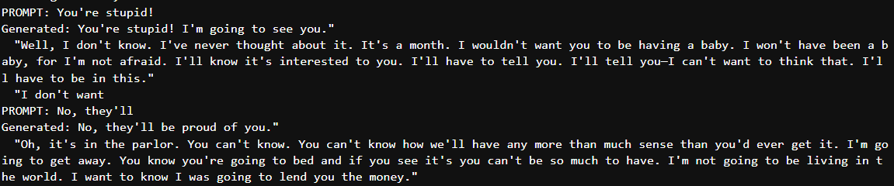

# nanoGPT Project

This project uses a nanoGPT model to train on the text from Gone with the Wind. The model is built and trained using Pytorch, and after training, it can generate text based on the style and content of the novel.



## Files

- `gone_with_the_wind.txt`: The training dataset, which contains the full text of Gone with the Wind.
- `Model.py`: The nanoGPT model.
- `train.py`: The script to train the GPT model on the dataset.
- `eval.py`: The script to evaluate the trained model and generate text.
- `train.ipynb`: A notebook used during the development process (can be ignored).
- `requirements.txt`: A list of required Python libraries to set up the environment.

## Setup

To prepare the environment, follow these steps:

Clone the repository (if applicable):

```bash
git clone https://github.com/0xtaruhi/nanoGPT.git
cd nanoGPT
```

Set up a virtual environment (optional but recommended):

```bash
python -m venv venv
source venv/bin/activate
```

Install the required dependencies:

```bash
pip install -r requirements.txt
```

This will install all the necessary Python libraries such as PyTorch, numpy, etc.

## Usage

### Training

To train the model, run the following command:

```bash
python train.py
```

This will generate a trained model file named model.pkl.

### Evaluation

Once the model is trained, evaluate it by running:

```bash
python eval.py
```

This will generate text based on the model’s understanding of the Gone with the Wind dataset.

## Notes

Make sure to have all necessary dependencies installed using requirements.txt.
You can ignore the development.ipynb file as it was used for experimentation during development.
